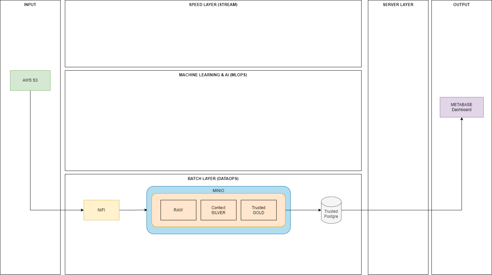

# Projeto da Equipe 7
## 1. DEFINIÇÃO DE UM PROBLEMA
Uma empresa de seguros está fazendo uma campanha para conceder descontos em suas ofertas, mas a empresa quer somente disponiblizar essa oferta para cidades com baixo indices de acidentes.
## 2. DEFINIÇÃO INGESTÃO EM DADOS (LOCAL DA ORIGEM, PODE JA EXISTIR OU PODE SER GERADO)	
REPOSITORIO S3
acidentes2022.csv (agrupado por pessoa)
datatran2022.csv (agurpado por ocorrencia)
## 3. DEFINIÇÃO ARQUITETURA (DESENHO NO MINIMO DE 2 PARTES DO TODO INGESTÃO E AMAZENAMENTO)
### Opção 1
1 NIFI ORQUESTRAÇÃO DE LEITURA (REPOSITORIO S3), GRAVAÇÃO NO RAW, TRATAR E GRAVAR NO CONTEXT E GRAVAR NO TRUST  
2 MINIO GERANDO PARQUET (RAW/CONTEXT)  
3 POSTGRESQL (TRUST)  
4 METABASE (DASHBOARD)  

### Opção 2
1 HIVE MAPEAR BASE DE ORIGEM (RAW)  
2 AIRFLOW LEITURA (RAW) VIA HIVE E GRAVAÇÃO NO POSTGRESQL (CONTEXT)  
3 MINIO GERANDO PARQUET (CONTEXT)  
4 POSTGRESQL (TRUST)  
5 METABASE (DASHBOARD)
## 4. IMAGEM DOCKER
Em elaboração
## 5. SUBIR NO GIT
Entregue no dia 17/05/2023
